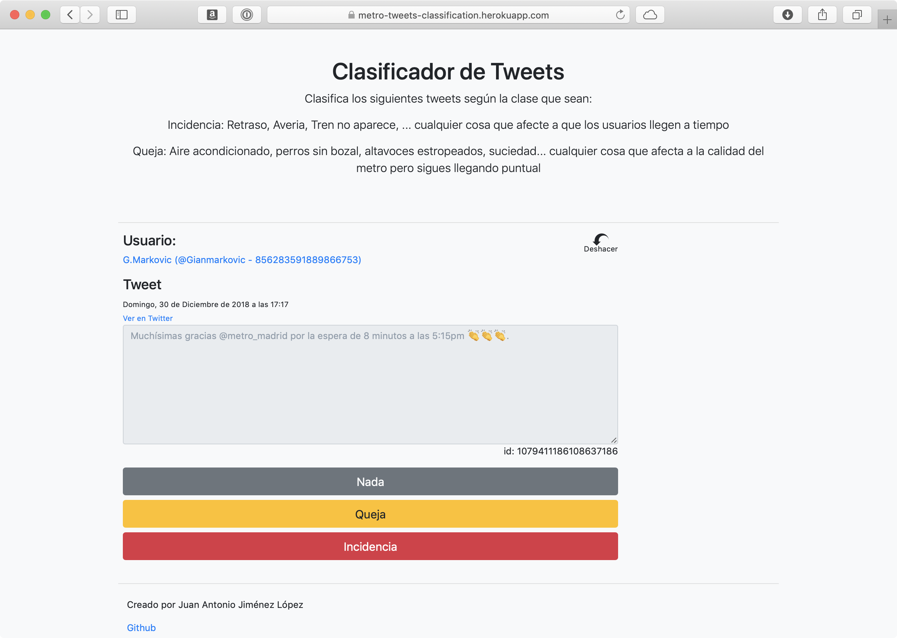

# App for Manual tweets classification about @metro_madrid

The goal of this project is to provide a webapp to classify tweets manually. It is composed of a backend in Express.js and a webpage with a simple javascript. The frontend requests a tweet to the backend and send it back when the user classify the displayed tweet into three different classes: Nothing, Issue or Complaint. The retrieves a random unclassified tweet from the MongoDB databases and send it to the frontend, also, when the frontend put the classified tweet it will be updated in the databased.

